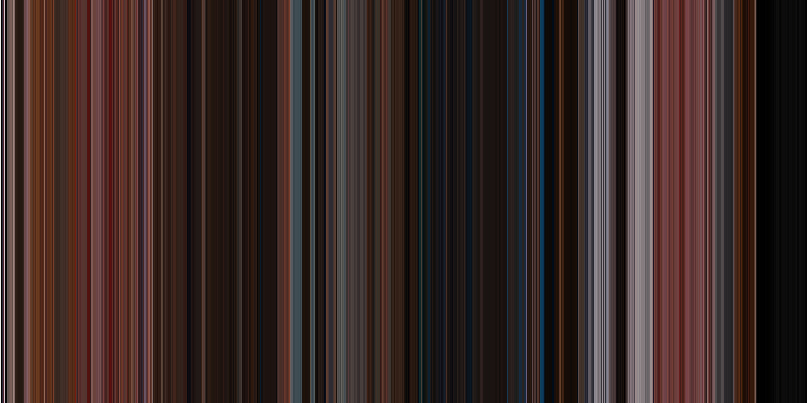

# Movie Colors Posters

### Overview

The point of this script is to generate a poster type image of color samples throughout the image. The idea is to sample an average color value of a frame, draw a bar with that color and repeat it for the whole movie. This results with an overview of movie color palette in a nice form factor.

### Installation

To use this script you only need Python 3.x (tested only on 3.8) and python modules listed in requirements. To install the modules (assuming configured Python environment) you need to simply call

`pip install /path/to/this/project/dir/requirements.txt`

### Usage

Basic call of this script looks like this:

`create_color_map.py -i <path_to_the_input_video_file> -o <path_to_which_output_image_will_be_saved> `

but you can configure multiple paramaters like size and sampling rate. You can find details by using `-h` or `--help` flag or below:

```
Color Map Properties

optional arguments:
  -h, --help            show this help message and exit
  -i INPUT_PATH, --input-path INPUT_PATH
                        Path to input video file of which color map will be created. Format support is determined by OpenCV support.
  -o OUTPUT_PATH, --output-path OUTPUT_PATH
                        Path defining where output image will be saved.
  -s SIZE, --size SIZE  Size (in pixels) of one of the images axis - height for default image, width for flipped (vertical). Other axis is defined by video length, sampling
                        interval and color section size. Default is 3000
  -css COLOR_SECTION_SIZE, --color-section-size COLOR_SECTION_SIZE
                        Size in pixels (height or width depending if image is horizontal or vertical) of mean color segment in the result image. Default is 1.
  -f, --flip            Decides whether image is presented vertically or horizontally. By default image is horizontal.
  -si SAMPLING_INTERVAL, --sampling-interval SAMPLING_INTERVAL
                        Number of frames between which mean color values is sampled. Default is 24, one sample per second for most movies.
  -v, --verbose         Determines how much information is included in logs
```

### Examples

A couple of results generated by this script:

**The Grand Budapest Hotel (2014)**



**Climax (2018)**


**Blade Runner (1982)**


